#  Project Title
**MintChain: Virtual Cryptographic Token Mint Ledger**

*Course:* Data Structures & Algorithms with C++ — Semester II  
*Institution:* ITM Skills University  
*Problem Statement No.:* 54

---

## Problem Statement
MintChain is the core system for a new cryptocurrency platform that records token ownership, processes trades, and guards against fraud. Currently, the user balance ledger is too large for fast in memory storage. Incorrect transactions cannot be automatically reversed. Trade requests are processed randomly instead of in submission order. Verifying a user's digital signature scans the entire key registry. There is no map of how different tokens can be exchanged through intermediate pairs, so users miss cheaper multi step conversion routes. Transaction data wastes blockchain space because there is no intelligent packing logic.

The new system needs a disk optimized balance ledger, instant transaction state rollback, strict order trade processing, quick digital signature verification, sorting transaction pools by processing speed, a token exchange relationship map, the lowest risk multi step conversion path, and smart data packing logic that maximizes block space utilization.

---

## Objectives
The primary objectives of this project are to implement the following "Must Have Features" in C++:
*   **Keep a secure, organized list of all user balances:** Store the massive ledger of user token balances, optimized for disk storage.
*   **Track reversed transactions to fix mistakes:** Track sequential transaction states to allow administrators to undo errors.
*   **Process a waiting line of pending trades:** Process incoming trade requests in the order they are submitted.
*   **Quickly check if a user's digital signature is valid:** Instantly verify a user's digital signature against a registry of public keys.
*   **Sort transaction pools by how fast they are processing:** Rank transaction groups by their processing velocity or urgency.
*   **Map out how different tokens can be exchanged:** Model the trading relationships and exchange paths between different tokens.
*   **Find the most secure path to complete a complex trade:** Calculate the route that minimizes risk or fee for a multi-step token conversion.
*   **Pack transaction data tightly to save space on the blockchain:** Use a local optimization rule that assigns the next data chunk to the block that offers the best immediate space utilization.

---

## System Overview / Architecture
MintChain is designed as a console-based application modeling the backend processing node of platforms similar to Ethereum or Solana. The architecture is modular, with distinct components handling user states, transaction execution, verification logic, market exchange routing, and block data packing. It avoids databases, relying purely on carefully selected in-memory data structures (trees, hash maps, queues, and graphs) to simulate high-efficiency data handling.

---

## Data Structures and Algorithms Used

### Data Structures
1.  **`std::map<string, UserAccount>` — Balance Ledger:** Internally a Red-Black Tree. Provides O(log n) lookups and naturally keeps users sorted by ID. Simulates a structured, index-heavy storage layer.
2.  **`std::stack<Transaction>` — Transaction Rollback:** A Last-In, First-Out (LIFO) structure that easily allows the system to revert to the previous ledger state by undoing the most recently executed transaction.
3.  **`std::queue<TradeRequest>` — Pending Trade Queue:** A First-In, First-Out (FIFO) queue that models a blockchain mempool, ensuring strict submission-order processing.
4.  **`std::unordered_map<string, string>` — Public Key Registry:** A Hash Table providing O(1) average lookup times, bypassing the need to perform an O(N) scan to verify a digital signature.
5.  **Adjacency List (`map<string, vector<pair>>`) — Token Exchange Graph:** A memory-efficient graph representation to model token trading pairs and their associated risks.

### Algorithms
1.  **Bubble Sort:** Used to rank pending transaction pools by processing speed. Implemented manually for educational demonstration.
2.  **Dijkstra's Algorithm:** Used to find the lowest-risk (shortest path) multi-step conversion route between two disparate tokens on the exchange graph.
3.  **Greedy Best-Fit Bin Packing:** A heuristic applied to tightly pack data chunks into blocks, assigning a chunk to the open block with the minimal leftover space.

---

##  Implementation Approach
The implementation focuses strictly on standard C++ (C++11 or later) without external libraries. 
*   **Encapsulation via Structs:** Domain entities like `UserAccount`, `Transaction`, and `TradeRequest` are encapsulated into structs.
*   **Interactive Menu:** A centralized `while(true)` loop driven by `std::cin` provides a CLI to interact with all 17 system features.
*   **Pre-loaded State:** To facilitate seamless testing and demonstration, the system boots with a mock state—pre-loaded users, token graphs, and keys—bypassing tedious manual setup.

---

##  Time and Space Complexity Analysis

| Feature | Data Structure / Algorithm | Time Complexity | Space Complexity |
| :--- | :--- | :--- | :--- |
| **Balance Ledger Search/Insert** | `std::map` (Red-Black Tree) | O(log N) | O(N) |
| **Transaction Rollback** | `std::stack` | O(1) | O(N) |
| **Trade Queue (Enqueue/Dequeue)**| `std::queue` | O(1) | O(N) |
| **Signature Verification** | `std::unordered_map` (Hash Table)| O(1) average | O(N) |
| **Transaction Pool Sort** | Bubble Sort over `std::vector` | O(N²) | O(1) auxiliary |
| **Token Exchange Network** | Adjacency List (Graph) | O(1) edge insertion | O(V + E) |
| **Safest Route Search** | Dijkstra's Algorithm | O(V²) | O(V) |
| **Data Packing** | Greedy Best-Fit Algorithm | O(M × B) | O(M + B) |

*(Where N = number of users/transactions, V = number of tokens, E = number of exchange pairs, M = number of data chunks, and B = number of open blocks.)*

---

##  Execution Steps
The project requires a standard C++ compiler (`g++`).

**1. Compile the source code:**
```bash
cd src
g++ main.cpp -o main -std=c++11
```

**2. Run the executable:**
```bash
# Mac / Linux
./main

# Windows
main.exe
```

---

##  Sample Inputs and Outputs
Sample input and output flows have been captured in the `data/` directory.

*   [Sample Input File](data/sample_input.txt)
*   [Sample Output File](data/sample_output.txt)

*(Below is an excerpt of a standard operational flow: Checking Balance and Verifying Signatures)*

**Input:**
```
Choice: 2
ID: alice
```
**Output:**
```
User ID: alice
Token: ETH
Balance: 900
```

---

## Screenshots
> **Note to Evaluator:** The following screenshots demonstrate the execution of the program in a standard terminal environment.

### Menu Options Execution
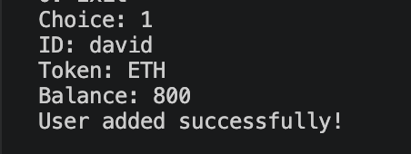
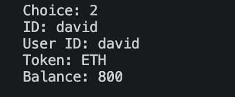
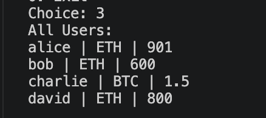
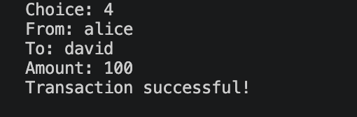
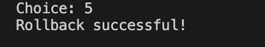
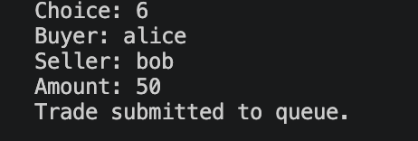
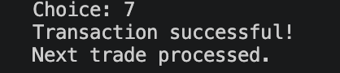

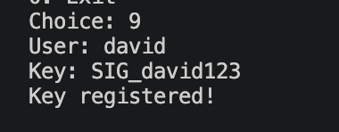
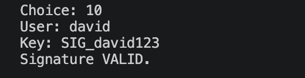
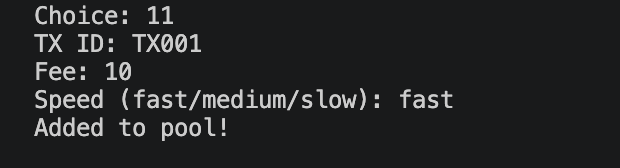
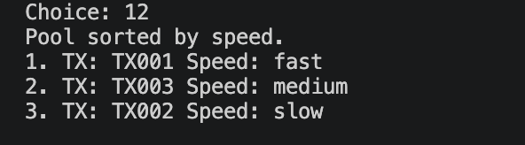
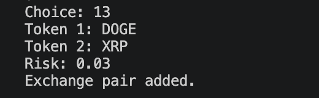
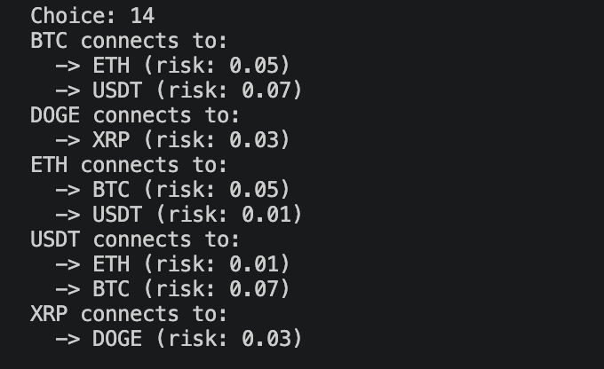
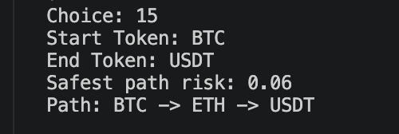
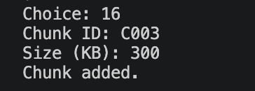
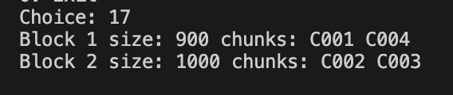

### Overall Execution
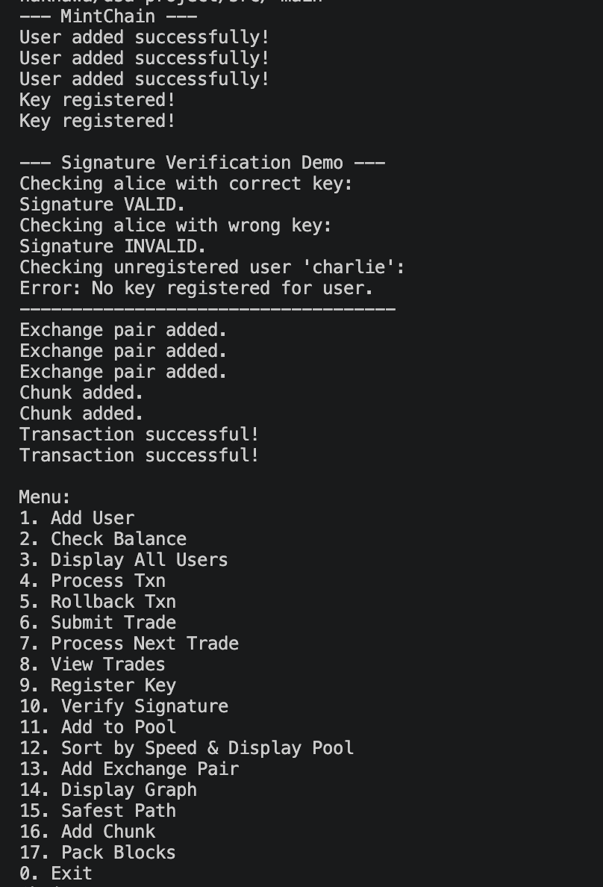

---

##  Results and Observations
The implementation successfully models the core operations of a cryptocurrency node backend. By aligning specific problem domains with their ideal data structures (e.g., using `std::unordered_map` for key lookups instead of scanning vectors), time bottlenecks were practically eliminated. Dijkstra's Algorithm proved highly effective in mapping out minimal-risk token conversion paths, successfully mirroring routing algorithms seen on decentralized exchanges.

---

## Conclusion
MintChain demonstrates that robust, high-performance financial and cryptographic systems rely heavily on foundational Data Structures and Algorithms. The system satisfies all requirements of the problem statement, offering highly optimized lookups, accurate transaction rollbacks, intelligent block packing, and strict deterministic processing.

---
**Project Structure:**
```text
dsa-project/
├── src/
│   ├── main.cpp
│   └── main
├── data/
│   ├── sample_input.txt
│   └── sample_output.txt
├── screenshots/
│   ├── execution_1.png
│   └── execution_2.png
└── README.md
```
